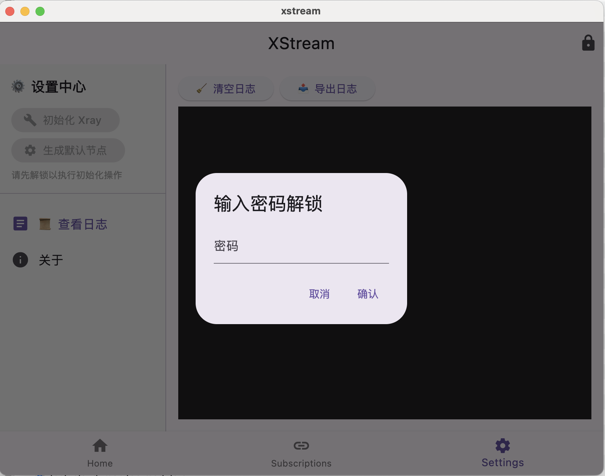
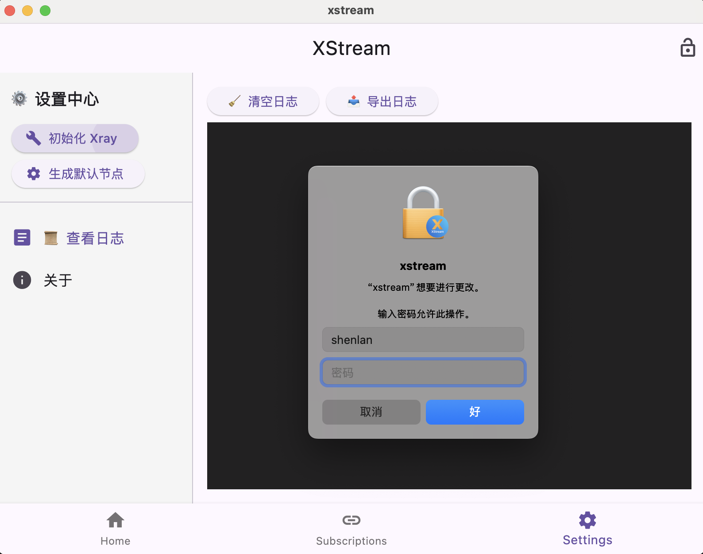
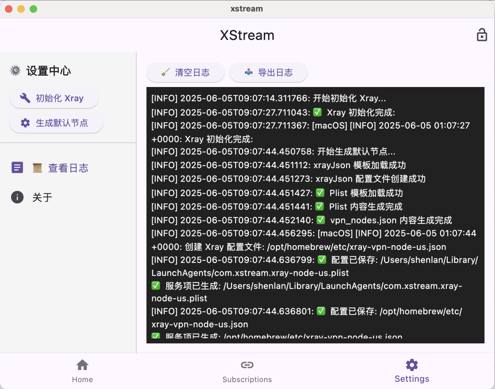

# 用户使用手册

XStream 是一个用户友好的多节点网络加速客户端，基于 Xray-core 构建，提供流畅、可靠的网络连接体验。

## 初始化与配置

本手册将指导你如何在 macOS 上完成 XStream 的初始化和默认节点生成操作。

### 安装并初始化

1. 下载并解压安装包。
2. 双击 `.dmg` 文件，首次运行时可能需要拖入 `Applications` 文件夹。
4. 系统提示“来源不明应用”时，可右键点击 → 选择“打开”。
5. 授权访问：系统可能会提示授予“网络权限”、“全盘访问”等，请允许。

---

## 步骤 1：点击右上角 🔒 图标解锁

首次使用前需要进行权限验证以解锁高级功能。

点击界面右上角的 🔒 图标，输入系统密码进行解锁。

---

## 步骤 2：初始化并更新 Xray Core

解锁成功后，点击左侧“设置中心”中的 `初始化 Xray` 按钮：

系统会弹出 macOS 原生权限窗口，请再次输入密码确认操作。
完成初始化后应用会自动下载并更新最新 Xray Core，然后在日志中生成默认节点配置。

---

## 步骤 3：生成默认节点（已自动完成）

初始化后应用会在后台自动创建配置文件、Plist 启动项与节点数据。

日志区域会显示详细的操作记录，包括配置保存路径、文件生成成功等信息。

---

## 步骤 4：添加自定义加速节点配置

点击底部导航栏中的 `Subscriptions` 标签页，在添加页面中填写你自己的节点信息，例如：

- 节点名（如 `Global-Node`）
- 服务器域名（如 `global-node.onwalk.net`）
- 端口号（如 `1443`）
- UUID（如 `18dxxxxx-xxxx-xxxx-xxxx-e7fxxxxx9b2`）

点击 `生成配置并保存` 按钮，系统将自动写入对应配置并可用于同步服务。

---
## 步骤 5：同步配置文件

在主界面中点击左侧的 `同步配置` 按钮，将当前选中的节点配置写入系统服务中。

此操作会根据选中的节点保存并应用配置到本地服务。

### 配置浏览器加速插件

使用 ZeroOmega 连接 Xray 节点。本指南假设你已经在本地或远程服务器上成功部署了 Xray-core，可在浏览器中通过 ZeroOmega 实现节点切换。

1. 安装 ZeroOmega 插件（https://github.com/zero-peak/ZeroOmega）。  
   ZeroOmega 支持 Chrome Web Store、Microsoft Edge Addons、Firefox Addon，兼容 SwitchyOmega，基于 Manifest V3。
2. 在 ZeroOmega 创建 Xray 节点配置：
   - 情景模式名称：例如 Xray-SOCKS5
   - 服务器类型：SOCKS5
   - 服务器地址：127.0.0.1
   - 端口：1080
   - 保存配置。
3. （可选）设置自动切换规则：
   - 创建新的「自动切换模式」，可导入 GFWList、PAC 或自定义规则。
   - 规则示例：
     - *.google.com  --> 使用 Xray-SOCKS5
     - *.youtube.com --> 使用 Xray-SOCKS5
   - 默认模式设置为「直连」，其余符合规则的域名通过 Xray 加速服务访问。
4. 效果验证：
   - 访问 https://www.google.com/ 等站点，确认是否已通过加速服务。
   - 也可通过浏览器访问 ip.sb 查询外网地址。

### 启动加速服务

1. 返回应用主界面，选择节点（如 🇺🇸 US-Node）。
2. 点击启动/停止按钮控制服务。
3. 可在“设置”页面查看实时日志信息。

### 匿名统计

在“设置中心”中，点击“查看收集内容”可查看收集到的 JSON 数据，按钮右侧的开关用于开启或关闭此功能。

---

##  常见问题&故障排查

- 若初始化按钮处于灰色，请先完成解锁。
- 若权限认证失败，请检查系统用户是否具备管理员权限。
- 日志中如显示路径无权限写入，请尝试以管理员身份运行程序。
- 无法联网？请确认端口是否正确配置为 `1080`，且节点状态为“运行”。

---
